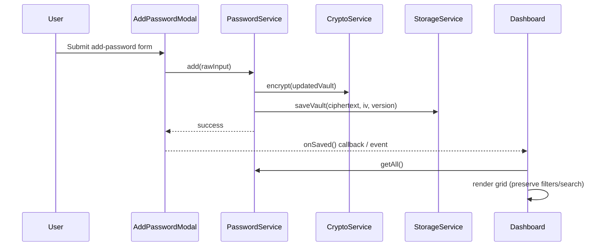
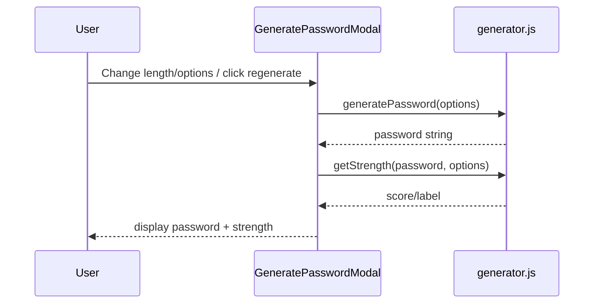

# Architecture (Module + Service Layer)

This repo is a vanilla HTML/CSS/JS password vault. The codebase uses:

- **Module pattern (ES Modules):** each file has private scope; only exports are public.
- **Service layer:** UI scripts call services; services coordinate crypto + persistence; lower layers never import higher layers.

## Goals

- Keep UI code (DOM + events) separate from business logic.
- Make it easy to swap persistence from `localStorage` → Express API later with minimal UI changes.
- Support a **zero-knowledge** model: server stores only ciphertext, client decrypts.

---

## Repository structure (expected)

```text
/
├── index.html
├── pages/
│   ├── signin.html
│   ├── signup.html
│   └── dashboard.html
├── css/
│   ├── main.css
│   ├── components.css
│   └── pages/
│       ├── landing.css
│       ├── auth.css
│       └── dashboard.css
└── js/
    ├── main.js
    ├── pages/
    │   ├── landing.js
    │   ├── signin.js
    │   ├── signup.js
    │   └── dashboard.js
    ├── modals/
    │   ├── add-password.modal.js
    │   └── generate-password.modal.js
    ├── services/
    │   ├── auth.service.js
    │   ├── password.service.js
    │   ├── crypto.service.js
    │   └── storage.service.js
    └── utils/
        ├── dom.js
        ├── generator.js
        └── validator.js
```

---

## Dependency rules (“who can import who”)

**Allowed direction (top → down):**

- `pages/*` and `modals/*` may import from `services/*` and `utils/*`
- `services/*` may import from other `services/*` and `utils/*`
- `storage.service.js` is the only module that touches localStorage / fetch
- `crypto.service.js` is the only module that touches WebCrypto APIs

**Forbidden direction (down → up):**

- `services/*` must never import `pages/*` or `modals/*`
- `utils/*` must never import `pages/*` or `modals/*`

> The UI calls services. Services never call UI.

---

## Responsibilities by folder

### `js/pages/` (Page controllers = DOM + orchestration)
Each file corresponds to exactly one HTML page and owns:
- DOM queries on that page
- event listeners on that page
- rendering for that page (or calls to render helpers)

Examples:
- `signin.js`: validate form, call `AuthService.login`, redirect or show error
- `dashboard.js`: render password grid, manage filter/search UI state, open modals, rerender on changes

### `js/modals/` (Modal controllers = DOM + orchestration inside a dialog)
Each modal module owns:
- open/close logic (buttons, overlay, Esc)
- internal event listeners (submit/cancel/regenerate/copy)
- parsing modal form inputs
- calling services and then signaling the dashboard to rerender

**Important:** modals should not import `dashboard.js`. Use:
- callback injection (`initAddPasswordModal({ onSaved })`), or
- custom events (`document.dispatchEvent(new CustomEvent("vault:changed"))`)

### `js/services/` (Domain logic + coordination)
Services expose a “public API” used by UI modules:
- no DOM access
- coordinate crypto and storage
- own data normalization (ids, timestamps, schema versions)

### `js/utils/` (Pure helpers)
Reusable helper functions that are not “domain services”:
- `generator.js`: password generation + strength scoring
- `validator.js`: email/url validation, form rules
- `dom.js`: generic UI helpers (clipboard, notifications, event delegation)

---

## Public service APIs (outline)

### AuthService (client orchestration)
- `register({ email, masterPassword }): Promise<void>`
- `login({ email, masterPassword }): Promise<void>`
- `logout(): void`
- `isUnlocked(): boolean`
- `getSessionEmail(): string | null`
- `getEncryptionContext(): { keyRef } | null` (conceptual; do not persist in localStorage)

### PasswordService (vault operations on decrypted data)
- `initFromEncryptedVault(encryptedPayload): Promise<void>`
- `getAll(): PasswordEntry[]`
- `add(input: PasswordEntryInput): Promise<void>`
- `update(id, patch): Promise<void>`
- `remove(id): Promise<void>`
- `search(query, entries?): PasswordEntry[]` (client-side)
- `filterByCategory(category, entries?): PasswordEntry[]`

### CryptoService (WebCrypto-only)
- `deriveKeyMaterial(masterPassword, salt, params): Promise<KeyMaterial>`
- `deriveEncKey(keyMaterial): Promise<CryptoKey>`
- `deriveAuthKey(keyMaterial): Promise<CryptoKey | ArrayBuffer>`
- `encryptJson(encKey, plaintextObj): Promise<{ ciphertextB64, ivB64 }>`
- `decryptJson(encKey, ciphertextB64, ivB64): Promise<object>`
- `computeAuthProof(authKey, challenge): Promise<string>` (if using challenge-response)

### StorageService (persistence adapter)
Local MVP:
- `loadVaultLocal(email): Promise<{ ciphertextB64, ivB64, version, saltB64, kdfParams }>`
- `saveVaultLocal(email, payload): Promise<void>`

API later:
- `registerRemote(request): Promise<response>`
- `loginRemote(request): Promise<{ encryptedVault }>` (Option 1)
- `saveVaultRemote(payload): Promise<void>`

---

## Data flow diagrams (Mermaid)

### Add password flow (modal → service → rerender)


### Generate password flow (generator util)


---

## Notes / gotchas

- Avoid duplicate `id` attributes inside repeated cards. Use classes or `data-*`.
- Avoid circular imports (`dashboard.js` importing modals while modals import dashboard). Prefer callbacks/events.
- “Refresh” means **rerender from service** (not a browser reload).
- For zero-knowledge, server-side search/filter is not possible without metadata leakage or advanced crypto.